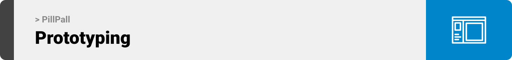

<br><br>

<!-- project philosophy -->


> Empowering patients, connecting doctors, and revolutionizing healthcare management.
>
>A mobile application providing patients the ease to manage their meds, track budgets, and access a personal assistant for guidance. Besides, patients can conveniently add their medical laboratory results, and connect with approved doctors to strengthen the patient-doctor relationship, all while ensuring privacy and convenience.

### User Stories
- As a patient, I want to have a detailed medical report, so that I can easily share my medical information with healthcare providers to avoid the repetitive task of recounting my medical history.
- As a patient, I want to be able to update the created medical report, so that I have the ability to keep my medical information accurate and up-to-date with any change.
- As a patient, I want to easily add a prescribed medicine along with its timing, dose quantity, and instructions, so that I can efficiently manage my medication schedule and ensure proper adherence to my treatment plan.
- As a patient, I want to effortlessly delete a medicine from my medication list, so that I can maintain an up-to-date record of my current medications.
- As a patient, I want to be able to press on any day in the calendar and instantly view the medications scheduled, so that I can effectively manage my medication intake and stay on track with my treatment plan.
- As a patient, I want to find nearby pharmacies based on my location, so that I can easily find a pharmacy that is convenient for me to visit for prescription refill.
- As a patient, I want to be able to track my medical expenses, so that I can have a clear understanding of my medication costs.
- As a patient, I want to search for and connect with doctors, so that I allow them to access my medications and report.
- As a patient, I want to have all my medical file numbers stored in one place, so that I can avoid the hassle of looking for physical copies of my file number every time.
- As a patient, I want to save my whole medical results in PDF formats with dates, so that I can have a comprehensive and organized record of my medical history that is easily accessible, shareable, and secure.
- As a patient, I want to have an AI personal medical assistant, so that I can receive reliable guidance, support, and information about my health and medications.
- As a patient, I want to be reminded for my prescription intake through a buzzer, so that I can maintain a consistent and effective treatment regimen.
- As a doctor, I want to have the ability to create and update a profile, so that I can showcase my professional expertise, qualifications, and experience.
- As a doctor, I want to have access to my patients’ medical report and medication online, so that follow I can follow my patients’ health easily, quickly and effectively.
- As an admin, I want to have the ability to access all users' reports and profiles, so that I can maintain data integrity, and monitor the overall system's performance.
- As an admin, I want to be able to approve doctors, so that I can provide them the access to the platform's specialized features and facilitate seamless collaboration between doctors and patients. 

- As a user, I want to have the ability to reset my password in case I forget it, so that I can regain access to my account and ensure the security of my personal information.
- As a user, I want to have the ability to change my password, so that I can ensure the security of my account and protect my personal information.

<br><br>

<!-- Prototyping -->


> PillPall's design was meticulously crafted, starting with wireframes and mockups. Through a process of iteration and refinement, the layout was fine-tuned to prioritize easy navigation and deliver a seamless user experience.


### Mockups
| Login | Register | Forgot Password | Reset Password |
| ---| ---| ---| ---|
| | | | 

| Welcome Patient (First Login) | Contact Information (First Login) | Anthropometric Measurements (First Login) | Emergency Contact Info (First Login) |
| ---| ---| ---| ---|
| | | | |

| Vital Signs (First Login) | Medical History (First Login) | Medications and Habits (First Login) | Report |
| ---| ---| ---| ---|
| | | | |

| Edit Report | Medication Schedule | Add Medicine | Delete Medicine |
| ---| ---| ---| ---|
| | | | |

| Nearby Pharmacies | Budget Tracker | Personal Assistant | File Numbers |
| ---| ---| ---| ---|
| | | | |

| Add File Number | Medical Results | Add Medical Result | Change Password |
| ---| ---| ---| ---|
| | | | |

| Patient Search | Fill Doctor Profile (First Login) | Profile | Edit Profile |
| ---| ---| ---| ---|
| | | | | |

| Doctor Search | Patient Report (Seen by Doctor) | Patient Result (Seen by Doctor) |
| ---| ---| ---|
| | |

<br><br>

<!-- Implementation -->


> Using the wireframes and mockups as a guide, we implemented the PillPall app with the following features:

### Common Screens (Mobile)
| Login | Register | Forgot Password | Reset Password |
| ---| ---| ---| ---|
| | | | |

### Patient Screens (Mobile)
| Welcome Patient (First Login) | Contact Info | Anthrometric Measurements | Emergency Contact Info |
| ---| ---| ---| ---|
| | | | |

| Vital Signs | Medical History | Medications and Habits | Report |
| ---| ---| ---| ---|
| | | | |

| Edit Report | Medication Schedule | Add Medicine | Delete Medicine |
| ---| ---| ---| ---|
| | | | |

| Nearby Pharmacies | Budget Tracker | Patient Search | File Numbers (Empty State) 
| ---| ---| ---| ---|
| | | | |

| Add File Number | File Numbers | Medical Results (Empty) | Add Medical Result |
| ---| ---| ---| ---|
| | | | |

| Medical Results | Medical Result File | Personal Assistant (Replacement) | Personal Assistant (Side Effect) |
| ---| ---| ---| ---|
| | | | |

| Personal Assistant (Instructions) | Personal Assistant (Question) | Change Password |
| ---| ---| ---|
| | | |

### Doctor Screens (Mobile)
| Fill Profile (First Login) | Profile | Edit Profile | Doctor Search |
| ---| ---| ---| ---|
| | | | |

| Patient Report (Seen by Doctor) | Patient Results (Seen by Doctor) | Doctor Search (Not Connected/Approved) |
| ---| ---| ---| ---|
| | | |

| Change Password | 
| ---|
| |

### Admin Screens (Mobile)
| Approved Doctors | Approved Doctor Report | Approved Doctor Report (Empty) | Patients |
| ---| ---| ---| ---|
| | | | |

| Patient Report | Patient Report (Empty) | Unapproved Doctors |
| ---| ---| ---| ---|
| | | |

| Unapproved Doctor Report | Approve Doctor |
| ---| ---|
| | |


<br><br>

<!-- Tech stack -->


###  PillPall is built using the following technologies:
- Employed [Laravel](https://laravel.com/), a powerful PHP framework for the backend of PillPall. Laravel provides a solid foundation for building secure and scalable backend systems. 
- Developed the frontend using [TypeScript with React Native](https://reactnative.dev/docs/typescript); this combination offers a more robust development experience by early error detection, and code maintainability.
- Leveraged the capabilities of [MySQL](https://dev.mysql.com/doc/) to securely store and retrieve user data. 
- Integrated the [ChatGPT API](https://openai.com/) for the personal assistant screen to get helpful guidance and assistance.
- Combined the power of [Arduino](https://www.arduino.cc/) with PillPall to create a more interactive and effective medication reminder system.
- Utilized the ["Open Sans"](https://fonts.google.com/specimen/Open+Sans) font as the main app font, and the design of the app adheres to the material design guidelines.
- 🚨 Please note that the functionality to find nearby pharmacies is currently unavailable due to maintenance of the underlying [HERE API](https://developer.here.com/)


<br><br>

<!-- How to run -->


> To set up PillPall locally, follow these steps:

### Prerequisites

1. Download Node.js installer from [https://nodejs.org/en/download]

2. Install Expo CLI 
    ```sh
    npm install -g expo-cli
    ```
    
3. Download XAMPP from [https://www.apachefriends.org/download.html]

4. Download Composer from [https://getcomposer.org/download/]

5. Download VS Code from [https://code.visualstudio.com/download]


### Installation

1. Get an Key for OpenAPI at [https://openai.com/] 

2. Launch MySQL and Apache from XAMPP

3. Open the terminal and navigate to the desired project directory

4. Clone the repository to your local machine
    ```sh
    git clone https://github.com/rasha-massoud/PillPall.git
    ```

5. Run the following command to install the Laravel app dependencies
    ```sh
    composer install
    ```

6. Open the folder
    ```sh
    code .
    ```

8. Install the official Node.js Library for OpenAi
    ```sh
    npm install openai
    ```

7. Copy the .env.example file to .env
    * Configure the database settings in the .env file
    * Add the OPENAI_API_KEY

8. Navigate to pillpall-backend 
    * Generate a Secret Key to handle token encryption
    ```sh
    php artisan jwt:secret
    ```

    * Create the database tables
    ```sh
    php artisan migrate
    ```

    * Create a symbolic link 
    ```sh
    php artisan storage:link
    ```

     * Execute the scheduled tasks
    ```sh
    php artisan schedule:run
    ```

    * Start the Laravel app
    ```sh
    php artisan serve
    ```

9. Open a new terminal window, and navigate to pillpall-mobile
    * Install the React Native app dependencies
    ```sh
    npm install
    ```

    * Start the Expo Server
    ```sh
    expo start
    ```
10. Download Expo Go on your Iphones

11. Scan the barcode in the terminal to launch the app on a physical device (Design based on Iphone)  

Now, you should be able to run PillPall locally and explore its features.