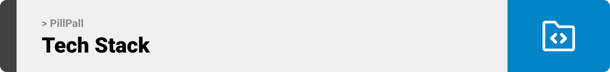

<br><br>

<!-- project philosophy -->


> 
>
> 

### User Stories
- 
- 
- 

<br><br>

<!-- Prototyping -->


> Ii designed PillPall using wireframes and mockups, iterating on the design until we reached the ideal layout for easy navigation and a seamless user experience.

### Wireframes
| Login screen  | Register screen |
| ---| ---| ---|
| --- | --- |

### Mockups
| Home screen  | Menu Screen | Order Screen |
| ---| ---| ---|
| ---| ---| ---|

<br><br>

<!-- Implementation -->


> Using the wireframes and mockups as a guide, we implemented the PillPall app with the following features:

### Patient Screens (Mobile)
| Login screen  | Register screen | 


### Doctor Screens (Mobile)
| Login screen  | Register screen |

<br><br>

<!-- Tech stack -->


###  PillPall is built using the following technologies:

- 

<br><br>

<!-- How to run -->


> To set up PillPall locally, follow these steps:

### Prerequisites

1. Download Node.js installer from [https://nodejs.org/en/download]

2. Install Expo CLI 

```sh
npm install -g expo-cli
```
3. Download XAMPP from [https://www.apachefriends.org/download.html]

4. Download Composer from [https://getcomposer.org/download/]

5. Download VS Code from [https://code.visualstudio.com/download]


### Installation

1. Get an Key for OpenAPI at [https://openai.com/] 

2. Launch MySQL and Apache from XAMPP

3. Open the terminal and navigate to the desired project directory

4. Clone the repository to your local machine
    ```sh
    git clone https://github.com/rasha-massoud/PillPall.git
    ```

5. Run the following command to install the Laravel app dependencies
    ```sh
    composer install
    ```

6. Open the folder
    ```sh
    code .
    ```

8. Install the official Node.js Library for OpenAi
    ```sh
    npm install openai
    ```

7. Copy the .env.example file to .env
    * Configure the database settings in the .env file
    * Add the OPENAI_API_KEY

8. Navigate to pillpall-backend 
    * Generate a Secret Key to handle token encryption
    ```sh
    php artisan jwt:secret
    ```

    * Ceate the database tables
    ```sh
    php artisan migrate
    ```

    * Start the Laravel app
    ```sh
    php artisan serve
    ```

9. Open a new terminal window, and navigate to pillpall-mobile
    * Install the React Native app dependencies
    ```sh
    npm install
    ```

    * Start the Expo Server
    ```sh
    expo start
    ```
10. Download Expo Go on your Iphones

11. Scan the barcode in the terminal to launch the app on a physical device (Design based on Iphone) 

Now, you should be able to run PillPall locally and explore its features.